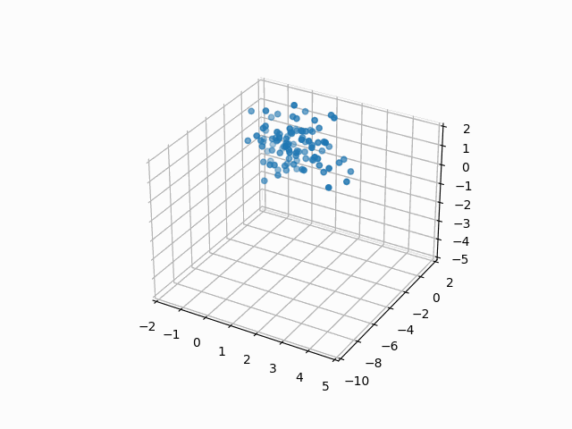

# General
The particle swarm optimization (PSO) algorithm is a metaheuristic algorithm that based on the simulation of the social behavior of birds within a flock.

The PSO is population-based, so first we must generate a population called swarm consisting of individual particles. Each particle is moving through high-dimensional search space guided by their personal best-known position in the search-space as well as the entire swarm's best-known position. Also each particle has its own velocity. 

# Algorithm

The algorithm is defined as following:

1. Create a ‘population’ of agents (particles) which is uniformly distributed over X.

2. Evaluate each particle’s position considering the objective function.

3. If a particle’s present position is better than its previous best position, update it.

4. Find a particle with the best position.

5. Update particles’ velocities. The formula is:

6. Move particles to their new positions:
  - Pick random numbers: rp, rg ~ U(0,1)
  - Update the particle's velocity: 
    \
    $V^{t+1} = WV^t  + c_1r_p (P_b^t - P^t) + c_2r_g (g_b^t - P^t)$
    - here is: 
      - W: Inertia weight, 
      - c1: cognitive constant, 
      - c2: social constant, 
      - P: Position of the particle, 
      - Pb: Personal Best, 
      - gb: global Best

7. Go to step 2 until the stopping criteria are satisfied.

$V^{t+1} = WV^t  + c_1r_p (P_b^t - P^t) + c_2r_g (g_b^t - P^t)$

# Results

In this .ipynb a forward propagation is implemented from scratch, a PSO instance from the pyswarms library is used as optimizer. The training process is repeated for 150 epochs on the mushroom data with a swarm that contains 100 particles. To visualize the results, we'll apply PCA transformation and select the first three components. We know that the PCA components are orthogonal, so we are able to visualize positions of particles in the swarm in each of the 150 epochs. 

